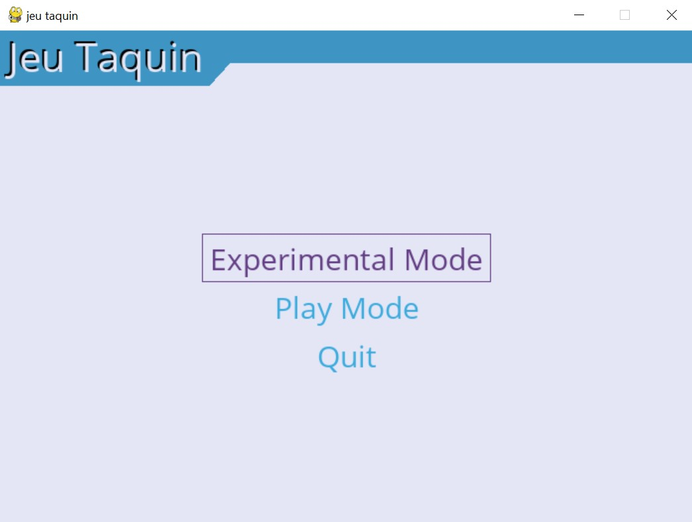

# 8 Puzzle solver in Python
A Python implementation of 4 diffrent algorithms to solve the 8-puzzle game using pygame for the GUI.
---
---

**Table of content:**
1. [Installing pygame and pygame-menu](#1installing-pygame-and-pygame-menu)
2. [Application Overview](#2application-overview)
3. [Play Mode](#3play-mode)
4. [Experimental Mode and the algorithms used](#4experimental-mode-and-the-algorithms-used)
    1. [bfs](#41bfs)
    2. [dfs](#42dfs)
    3. [limited dfs](#43limited-dfs)
    4. [A*](#44a)
5. [Conclution](#5conclution)

## 1.Installing pygame and pygame-menu:

pygame : `pip install pygame`<br>
pygame-menu: `pip install pygame-menu -U`<br>
[Pygame-menu](https://pygame-menu.readthedocs.io/en/4.2.8/#:~:text=Pygame%2Dmenu%20is%20a%20python,with%20multiple%20options%20to%20customize.) is a python-pygame library for creating menus and GUIs

## 2.Application Overview:

This application is divided into two sections :
- experimental mode🧪: experimental mode allows you to solve the 8-puzzle game with 4 different algorithms and count the number of visited nodes in each algorithme
- play mode 🎮: play Mode allows you to try and beat the game yourself.



---

## 3.Play Mode:

You can increase the difficulty of the game by increasing the __SHUFFLE_NUMBER__ constant.


## 4.Experimental Mode and the algorithms used:

You can change the start and the target bord by changing this constants:
```py
BORD=[
    [3,2,7],
    [8,6,0],
    [1,5,4]
]
TARGET=[
    [1,2,3],
    [8,0,4],
    [7,6,5]
]
```


## 4.1.bfs:
__Breadth-first search__ (BFS) is an algorithm for searching a tree data structure for a node that satisfies a given property. It starts at the tree root and explores all nodes at the present depth prior to moving on to the nodes at the next depth level. Extra memory, usually a queue, is needed to keep track of the child nodes that were encountered but not yet explored.


## 4.2.dfs:
__Depth-first search__ (DFS) is an algorithm for traversing or searching tree or graph data structures. The algorithm starts at the root node (selecting some arbitrary node as the root node in the case of a graph) and explores as far as possible along each branch before backtracking.


## 4.3.limited dfs :
__limited dfs__ is a state space/graph search strategy in which a depth-limited version of depth-first search is run repeatedly with increasing depth limits until the goal is found.

## 4.4.A*:
__A*__ is a heuristic algorithm sacrifices optimality, with precision and accuracy for speed, to solve problems faster and more efficiently.


## 5.Conclution:

After running these algorithms we get this:


__we can notice that the number of visited nodes in the A* algorithm is the smallest and the limited dfs(with a limit of 3) does not have a solution(-1)__

<p style="text-align:center;font-size:20px;">made by <a href="https://github.com/amine-a11">amine-a11</a> && <a href="https://github.com/mehrezbey">mehrezbey</a></p>

